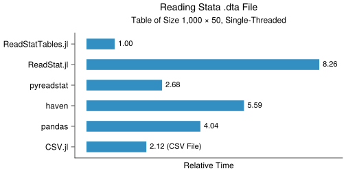
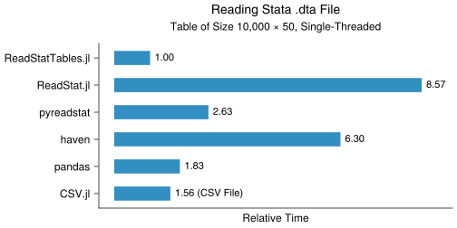
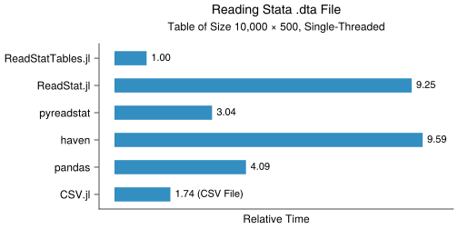

# ReadStatTablesBenchmarks

*Benchmarks for ReadStatTables.jl and related packages*

This repository is for benchmarking
[ReadStatTables.jl](https://github.com/junyuan-chen/ReadStatTables.jl)
against related packages.
Scripts for generating the sample data
and running the benchmarks are located at the [`benchmark`](benchmark) directory.
Sample data are stored in the [`data`](data) directory.
Results are saved in the [`results`](results) directory
for each version of ReadStatTables.jl since v0.2.0.

## Latest Benchmarks

Results are based on reading Stata .dta files with a single thread.
Parameters (keyword arguments) for reading the files are default values.

### Packages

- [ReadStatTables.jl](https://github.com/junyuan-chen/ReadStatTables.jl) v0.2.0
- [ReadStat.jl](https://github.com/queryverse/ReadStat.jl) v1.1.1
- [pyreadstat](https://github.com/Roche/pyreadstat) v1.2.0
- [haven](https://github.com/tidyverse/haven) v2.5.1
- [pandas](https://github.com/pandas-dev/pandas) v1.5.2
- [CSV.jl](https://github.com/JuliaData/CSV.jl) v0.10.8

Python and R packages are installed with
[CondaPkg.jl](https://github.com/cjdoris/CondaPkg.jl).
Python functions are called via [PythonCall.jl](https://github.com/cjdoris/PythonCall.jl).
R functions are called via [RCall.jl](https://github.com/JuliaInterop/RCall.jl).
Benchmark results are produced with
[BenchmarkTools.jl](https://github.com/JuliaCI/BenchmarkTools.jl).

### Environment

- Julia v1.8.3
- Python v3.11.0
- R v4.2.2

```
Platform Info:
  OS: macOS (arm64-apple-darwin21.3.0)
  CPU: 10 × Apple M1 Pro
  WORD_SIZE: 64
  LIBM: libopenlibm
  LLVM: libLLVM-13.0.1 (ORCJIT, apple-m1)
  Threads: 8 on 8 virtual cores
```

### Results

<p align="center">
  <br><br>
  <br><br>
  <br><br>
</p>

